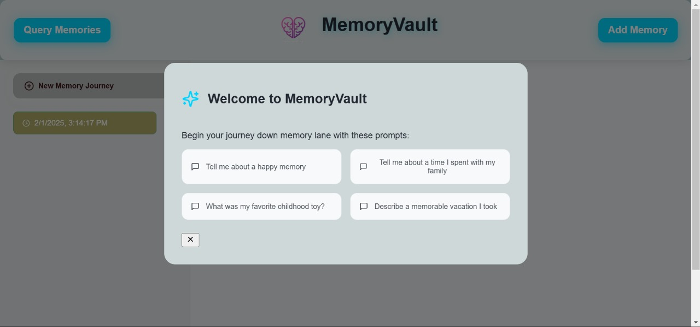
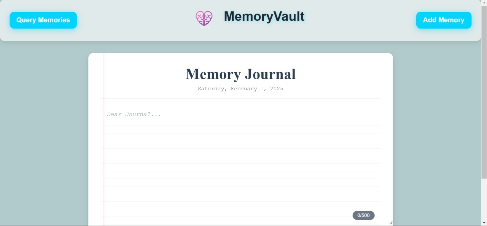
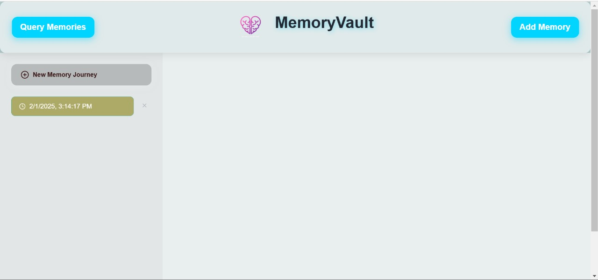

# 🧠 MemoryVault - Preserving Memories Through AI 💫

## 📖 The Story Behind MemoryVault

💭 Memories make us who we are. In a world where over **55 million** people live with Alzheimer's disease, watching our loved ones lose their precious memories is heartbreaking. Alzheimer's doesn't just affect memory - it damages the neural connections that define our experiences, relationships, and identity.

❤️ MemoryVault was born from a deep understanding of this challenge. Like many families affected by neurodegenerative diseases, we've witnessed firsthand how these conditions can rob people of their cherished memories. Our mission is to help preserve and relive these precious moments using the power of AI.

## 🌟 What is MemoryVault?

🤖 MemoryVault is an AI-powered memory companion that helps Alzheimer's patients reconnect with their memories in a meaningful and immersive way. By combining advanced language models with visual AI, we create a unique experience where memories come alive both through words and images.

## ✨ What it does
MemoryVault is an AI-powered memory preservation and retrieval system that helps Alzheimer's patients and their families:
- 📝 Store and organize personal memories in a secure digital vault
- 💬 Retrieve memories through natural conversation
- 🎨 Experience memories visually through AI-generated imagery
- 🤝 Engage with past experiences in an interactive, emotionally connected way
- 👨‍👩‍👧‍👦 Share and preserve family histories across generations

### 🎯 Key Features

- 💾 **Memory Storage**: Easily store important memories through a simple interface
- 🗣️ **Natural Conversations**: Have natural conversations about past memories
- 🖼️ **Visual Memory Recreation**: AI-generated visualizations of memories using FLUX API
- 🔍 **Smart Memory Retrieval**: Advanced semantic search to find relevant memories
- 🌈 **Immersive Experience**: Combination of vivid descriptions and visual representations

## 🛠️ Technical Implementation

### 🏗️ Architecture
- 🖥️ **Frontend**: Flask interface for seamless user interaction
- ⚙️ **Backend**: Python-based API with advanced memory processing
- 💽 **Storage**: Vector database using Groclake for efficient memory retrieval
- 🤖 **AI Integration**: 
  - 📊 Text processing and memory retrieval using Groclake's VectorLake
  - 🎨 Visual memory recreation using FLUX API

### 🔄 Memory Processing Pipeline
1. 📥 **Memory Input**: Memories are captured and processed
2. 🔢 **Vectorization**: Converted into embeddings for semantic search
3. ✂️ **Smart Chunking**: Split into optimal sizes for retrieval
4. 🔮 **AI Enhancement**: Processed to create vivid, detailed responses
5. 🎨 **Visual Generation**: Transformed into visual representations

## 🌈 Impact and Vision

MemoryVault aims to:
- 🤝 Help Alzheimer's patients maintain connections with their past
- 👨‍👩‍👧‍👦 Support families in preserving precious memories
- 🌟 Provide a dignified and empowering way to access memories
- 💝 Create a more supportive environment for those affected by memory loss

## 🔧 How We Used Groclake Tools

MemoryVault leverages **Groclake's VectorLake** and **ModelLake** to efficiently store, retrieve, and process memories. Here's how we utilized these tools:

- 📊 **VectorLake:**
  - 🔄 Converts memory text into vector embeddings for efficient semantic search
  - 💾 Stores memory chunks with metadata for contextual retrieval
  - ⚡ Provides fast and relevant memory retrieval based on user queries

- 🤖 **ModelLake:**
  - 💭 Processes natural language queries to generate conversational responses
  - 💫 Enhances user interaction by making memories more vivid and emotionally engaging
  - 🎯 Ensures context-aware and accurate retrieval of stored memories

## 📈 How Groclake Helps Our Project

The integration of Groclake tools has significantly improved the efficiency and effectiveness of MemoryVault:

- ⚡ **Fast Memory Retrieval:** VectorLake enables quick semantic search
- 🧠 **Contextual Understanding:** ModelLake enhances memory retrieval responses
- 📈 **Scalability:** Handles large volumes of user memories efficiently
- 🤝 **Improved AI Interactions:** Interactive and personalized experience

## 🔄 Workflow

1. 📥 **Memory Storage:**
   - User submits a memory text via the frontend
   - The text is split into chunks using a text splitter
   - Each chunk is embedded as a vector using VectorLake
   - Metadata is assigned, and the memory is stored

2. 🔍 **Memory Retrieval:**
   - User submits a query about a past memory
   - Query is converted into a vector using VectorLake
   - Similarity search performed in the vector database
   - ModelLake generates engaging responses
   - AI-powered image enhances recollection

3. 💫 **Memory Interaction:**
   - Natural and engaging user interactions
   - Continuous system improvement

## 🎯 Future Roadmap

We're committed to expanding MemoryVault's capabilities:
- 👥 Multi-user support with personalized memory spaces
- 🗣️ Voice interaction for easier accessibility
- 🎨 Enhanced visual memory recreation
- 📅 Memory timeline visualization
- 👨‍👩‍👧‍👦 Family sharing and collaboration features
- 🏥 Integration with medical care systems

## 💫 Conclusion
The integration of Groclake's tools has been crucial in building this memory preservation system. Together, we're making a difference in the lives of those affected by Alzheimer's.

🌟 MemoryVault is more than just a technical solution - it's a bridge to the past, helping preserve the stories that make us who we are. Join us in making a difference in the lives of those affected by Alzheimer's. 💝

---

## 📸 Media Gallery

### Welcome Screen

### Memory Interface

### Memory Management

### Query System

### Demo Video
https://github.com/yourusername/MemoryVault/raw/main/Image/Grock_MemoryVault%20-%20Made%20with%20Clipchamp.mp4
